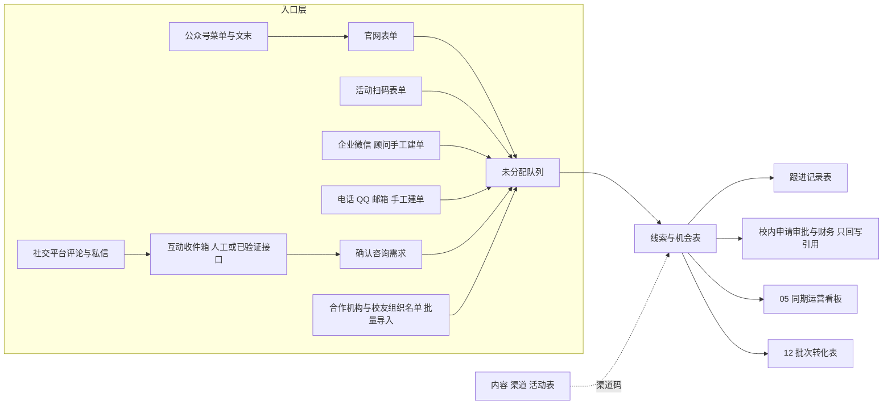

# 南京大学 EDP 招生运营系统蓝图

研究日期：2026-09-12；接口与评论入口修订：2026-09-14。平台官方能力、准入与限制见 [18-招生渠道 API 对接可行性调研](18-招生渠道API对接可行性调研.md)。面向中心负责人、招生顾问、校内信息化对接人和实施者。本文把 `10` 的决策结论落成可配置的规格：对象、入口、阶段、自动化、权限、搭建顺序和验收。前提是 `10` 的路径二，即在校方批准的现成平台上配置，不从零开发；`16` 第二节的官网承接问题在第一期一并修复。所有学费、日期、席位字段只在取得审批件后填写。

## 一、目标与边界

**一句话定义：** 一个由校方持有、顾问每天使用的招生运营工作台，把所有入口的咨询统一接进来，分级、分配、跟进、记录到申请与缴费，并能回答"哪条内容、哪个渠道带来了哪些线索和哪些缴费"。

**验收标准只有一条：** 任意一笔财务确认的缴费，都能沿线索、跟进记录、渠道码追溯到首次来源和最近来源；任意一条内容或活动，都能列出它带来的有效线索与后续阶段。做不到这一条，系统只是一张更好看的表。

### 1.1 闭环六节点：系统做什么，人做什么

| 节点 | 系统负责 | 人负责 | 对应文件 |
|---|---|---|---|
| 客户定位 | 记录项目、班次、目标人群标签 | 访谈、选主推项目、定口径 | `01`、`06` |
| 内容生产 | 登记内容编号、审核版本、发布日期 | 选题、写稿、教授录制、`13` 审核 | `08`、`09`、`13` |
| 渠道发布 | 渠道码生成与归因 | 发布、活动执行、机构对接 | `16` |
| 线索识别 | 统一接收、查重、初分级、分配、SLA 计时 | 电话、评论与私信的人工承接、分级确认 | `04`、本文第四节 |
| 销售跟进 | 待办、逾期提醒、阶段准入校验、历史留痕 | 咨询、写跟进、判断阶段 | `01` 第八节、`11` |
| 成交与复购 | 申请号与财务确认引用、同期看板、批次转化、复购识别 | 校内申请审批与收费 | `05`、`12` |

### 1.2 第一期明确不做

自动发布到四个平台；未经逐项验证的评论、私信全量接入；任何形式的自动群发；AI 自动分级或自动改阶段；教务、发证、学员社区、会话存档；自研 CRM；多校复用。这些在 30 天试点有数据后再议。官方接口存在不等于账号获批；已取得权限的单项能力可按第 4.5 节小范围验证，不作为主流程上线前提。

### 1.3 治理前提

账号、数据和管理员由校方持有，实施者在试点期持配置权限，移交后撤销。正式申请审批与收费仍在校内流程完成，系统只保存官方申请号和财务确认结果。实施者的角色是工具配置与培训，不接触收费，不以中心名义对外招生，见 `10` 第十节。

## 二、总体结构

### 2.1 平台选择

| 顺序 | 选项 | 条件 |
|---|---|---|
| 1 | 校方已采购并允许中心使用的协作平台 | `10` 第十一节第 1、4 项核验通过后直接复用 |
| 2 | 飞书多维表格 | 试点默认；需先按 `10` 第 5.2 节验证看板、分享页、推送的权限边界，并核验适用套餐报价 |
| 3 | 简道云 | 流程和权限更细时的备选；平台订阅与 CRM 套件分别计价，采购前询价 |
| 4 | 自研 | 只做落地页、表单和到平台的写入接口；核心对象与权限不自研 |

企业微信默认作为顾问沟通工具，人工建单；客户关系同步可在权限确认后单独试点，不能因此获取聊天全文。微信客服是另一项接待能力，需独立核验。保留最早可证实来源，未知则记录未知与客户自报。

## 三、对象模型

六张业务表，另设第 4.4 节的互动收件箱作为处理台账。`04-线索CRM模板.csv` 是"联系人 ⋈ 线索"的导出视图，系统内拆开存；`11`、`12` 与系统表同构，导出即可对上。

### 3.1 表与关键字段

| 表 | 主键 | 关键字段 | 说明 |
|---|---|---|---|
| 联系人 | `CT-0001` | 姓名、手机号、微信、邮箱、职位、决策角色、所属企业ID、城市、营销同意、同意时间、告知版本、同意用途、撤回时间、历史班次、查重状态 | 同意记录挂在人上，不挂在线索上；历史班次用于复购识别 |
| 企业 | `ORG-0001` | 名称、行业、规模、城市、类型（民企/国企/政府/机构/校友组织）、合作历史、关联联系人 | 一企业多联系人 |
| 线索与机会 | `LEAD-0001` | 联系人ID、企业ID、意向类型（公开课/企业定制）、意向项目、意向班次、核心问题、计划学习时间、付款主体、首次来源一级、首次来源二级、首次渠道码、最近渠道码、用户自报来源、线索等级、负责人、首次响应时间、最近联系日期、下一步动作、下次跟进日期、当前阶段、申请日期、官方申请号、缴费日期、财务确认日期、实收金额、退款金额、未成交原因 | 一人对一个项目一条；只保留当前快照 |
| 跟进记录 | `FU-0001` | 线索ID、联系人ID、时间、操作者、动作类型、渠道、沟通摘要、客户问题、购买障碍、阶段变更前、阶段变更后、下一步动作、下次跟进日期 | 只追加；阶段变更由系统自动写一条 |
| 项目与班次 | `PRJ-01` / `CLS-2026-01` | 项目名、类型、审批编号、简章版本、开班日期、结束日期、席位、学费、状态（筹备/招生中/已开班/已结束） | 学费、日期、席位只在审批后填写；过期简章版本不得对外发送 |
| 内容、渠道与活动 | 渠道码 | 平台、母题、内容标题、发布日期、审核版本、审核人、活动日期、活动地点、报名数、到场数、关联线索数 | 渠道码格式见 `08` 第 3.2 节 |

### 3.2 编号与查重规则

- 编号由系统自动生成，前缀固定，不复用，不手改。
- 手机号、微信、邮箱任一相同即列为候选重复，由顾问确认合并；合并保留最早联系人ID，历史班次与跟进记录并入。
- 跨平台只有昵称时不合并。评论或私信先登记互动；确认咨询需求后可凭平台、授权账号和可获得的用户标识建联系人，昵称仅为显示名。取得可靠身份后再核验关联。
- 同一联系人对第二个项目的意向新建线索，不改旧线索。

### 3.3 渠道码前缀

沿用 `08` 第 3.2 节并补齐本文用到的入口：WX 公众号、DY 抖音、XHS 小红书、WB 微博、BD 百度搜索、WEB 官网、EVENT 线下活动、PARTNER 合作机构与校友组织、REF 老学员转介绍、ALL 全平台同步；付费单元前加 `AD-`。示例：`WEB-OFFICIAL-01`、`PARTNER-SMEJS-01`、`REF-C22-01`、`AD-BD-PROGRAM-01`。

## 四、入口与线索识别

这是第一期的核心。自动入口收到数据后 30 分钟内完成登记或生成失败待办；人工平台入口按工作时段每 2 小时巡查的试点频率登记，主管按容量调整。记录平台发生、发现、系统接收和人工响应时间，分别衡量漏看与接待迟延。来源能证实则填，未知不补造渠道码；互动不自动建人。

### 4.1 入口清单

| 入口 | 进入方式 | 首次渠道码 | 责任人 | 第一期状态 |
|---|---|---|---|---|
| 官网咨询与报名表单 | 修复 `16` 第二节指出的失效链接，新表单直接写入线索表；字段限最小必要：姓名、手机号、公司、职位、城市、意向项目、核心问题、计划学习时间、营销同意勾选（不默认勾选）、告知版本号 | `WEB-OFFICIAL-01`，项目页各自一码 | 内容运营维护，法务定隐私文本 | 必做 |
| 活动扫码表单 | 每场活动独立表单，报名与到场分开记录 | `EVENT-母题-序号` | 活动负责人 | 必做 |
| 公众号 | 菜单/文末承接表单；文章留言与账号消息也纳入巡查，获适用权限后可试接接口 | `WX-母题-序号`；不能定位内容则仅记账号来源 | 内容运营 | 人工必做，接口待验证 |
| 企业微信 | 顾问确认需求后建单；企业微信记录为当前接触渠道，首次来源按已有证据保留，自报单列 | 按自报 | 顾问 | 必做，默认人工 |
| 电话、QQ、邮箱 | 顾问按咨询处理时段登记；QQ 保留但在官网标注为非主渠道 | 自报来源 | 顾问 | 必做 |
| 抖音、小红书及已运营的微博、视频号评论/私信 | 先登记互动、原平台答复；确认需求后转机会。不得要求用户必须先私信 | 按已知平台和内容关联；视频号先单列平台字段，正式前缀另行统一 | 运营与顾问 | 人工必做；接口按第 4.5 节 |
| 合作机构与校友组织名单 | 优先用专属表单由本人提交；名单导入核验提供范围和联系用途，机构同意不代替个人营销同意 | `PARTNER-机构-序号` | 负责人 | 视 `16` 第五节进展 |
| 老学员转介绍 | 每位推荐人一个邀请码，被推荐人填码或顾问录入 | `REF-班级-序号` | 顾问 | 第二个月 |

### 4.2 初分级规则

按 `01` 第 8.1 节的四级，系统按字段做初分，顾问在首次响应时确认：

| 等级 | 系统初分条件 | 顾问确认要点 |
|---|---|---|
| A | 意向项目明确、计划学习时间在 3 个月内、付款主体明确、营销同意为是 | 电话确认真实性与预算路径 |
| B | 意向项目或问题明确，但时间或付款主体未定 | 约定培育内容与再联系时间 |
| C | 字段不全或意向泛化 | 待澄清；当前问题由运营答复，持续内容触达需相应同意 |
| D | 信息虚假、明确不匹配 | 不进入销售跟进；无营销同意单独管理，不直接判 D |

互动先判断是否有咨询需求，再进行线索初分；营销同意为否或待确认时仍可处理当前主动咨询，但不得启动持续营销。初分只决定进入哪个队列，不决定阶段；"已核验有效"阶段的准入条件见第五节。

### 4.3 分配与 SLA

- 未分配队列按项目和地区规则自动指派；规则不命中的进入主管队列，30 分钟未处理提醒主管。
- SLA 从线索进入系统的时间起算：A 类工作时段 2 小时内人工首次响应；活动线索 24 小时内完成分级；A 类 72 小时内完成深度咨询；企业需求访谈后 5 个工作日内给一页项目假设（`15`）。自动欢迎语不算人工响应。
- 工作时段由中心定义并写入系统参数，SLA 计算只在工作时段内累计。

### 4.4 互动收件箱与评论承接

收件箱为六张业务表之前的台账，最少记录：平台、授权账号、互动类型、内容与评论/消息 ID、父评论 ID、平台用户 ID（若有）、必要咨询文本、原平台链接、发生/发现/接收/人工响应时间、负责人、处理状态、来源证据及关联线索 ID。人工登记与 API 使用同一结构，接口未提供的字段允许为空。

处理流程：发现咨询 → 登记与分配 → 在原平台答复 → 确认项目需求后转机会。无业务问题的普通互动不自动转 CRM；不强制索取手机号，不凭同昵称跨平台合并。一个评论者可以得到完整答复而不成为销售线索。

收件箱按运营账号和负责范围授权；内容运营可处理自己账号的必要咨询记录，不因此获得全部联系人、私信或销售明细。另设“待处理互动”视图，七个业务视图继续保留。

### 4.5 API 启用门槛

详细官方证据与案例见 [18](18-招生渠道API对接可行性调研.md)。每条连接分别通过官方能力、账号权限、真实样例验证后才启用；评论读取、私信读取、广告线索和发送回复分别验收。

| 能力 | 当前设计状态 |
|---|---|
| 官网、活动表单写入 | 第一期必做 |
| 抖音评论、公众号留言/消息 | 有官方接口证据；核验学校账号权限后择一试点 |
| 小红书私信与意向评论 | 有官方产品和准入证据；全量自然评论范围未核实，默认人工 |
| 企业微信客户关系、微信客服 | 独立可选能力；前者不含聊天全文，后者需核验接待流程变化 |
| 巨量引擎、百度广告线索 | 发生实际投放并取得当前授权后再接 |
| 视频号原生互动、既有个人 QQ | 本次未验证适用的通用接入，保留人工 |

连接需有去重、失败重试、授权到期告警、平台数量核对与人工兜底；无法补回的历史缺口单独记录。工作台显示已覆盖范围，不宣称已采集平台全部咨询。应用密钥不放入业务表或仓库。

## 五、跟进与阶段

### 5.1 两条流水线与准入条件

公开课：

| 阶段 | 准入条件（系统校验必填） |
|---|---|
| 新咨询 | 线索已创建 |
| 已核验有效 | 姓名、公司、职位、城市、意向项目或核心问题、计划学习时间、营销同意 全部非空 |
| 已完成深度咨询 | 跟进记录中存在动作类型"深度咨询"，且客户问题、购买障碍、下一步、下次跟进日期非空 |
| 已申请 | 官方申请号非空 |
| 审核结果 | 审核结论字段非空（通过/不通过/待补） |
| 财务确认缴费 | 财务确认日期与实收金额非空；付款截图不算 |
| 入学交接 | 班次ID非空，交接记录一条 |
| 旁路状态 | 不匹配、暂缓、退订、撤回、退款；进入撤回或退订后停止营销提醒，必要申请服务按适用要求处理 |

企业定制：目标企业 → 需求确认 → 关键联系人及决策流程确认 → 方案 → 采购/合同 → 成交与交付移交。"方案"阶段准入为 `15` 一页项目假设已提交并记录版本；"采购/合同"准入为预计金额、预计时间及其证据非空；未提供依据的预测不计入收入。

### 5.2 顾问工作台视图

| 视图 | 内容 | 使用者 |
|---|---|---|
| 今日待办 | 下次跟进日期为今天、以及 SLA 即将到期的线索 | 顾问 |
| 逾期 | 下次跟进日期已过且无新跟进记录 | 顾问、负责人 |
| 我的 A 类 | 本人负责、等级 A、未到申请阶段 | 顾问 |
| 未分配 | 队列中无负责人的线索 | 负责人 |
| 本周新增 | 按首次渠道码分组的新线索 | 负责人、内容运营 |
| 企业机会 | 企业定制流水线看板 | 负责人 |
| 待核验申请 | 已填申请号、财务确认为空 | 负责人、教务对接 |

### 5.3 自动化规则

| 编号 | 触发 | 条件 | 动作 |
|---|---|---|---|
| R1 | 新线索创建 | 无负责人 | 进入未分配队列；30 分钟后仍无负责人则通知主管 |
| R2 | 新建或确认为 A 类线索 | 等级 A | 按线索进入系统时间计算工作时段 2 小时 SLA；指派不重置计时，到期前 30 分钟提醒，超时通知主管 |
| R3 | 每日 08:30 | 下次跟进日期为今天 | 推送今日待办 |
| R4 | 每日 08:30 | 下次跟进日期已过 1 天以上 | 推送逾期清单给顾问，逾期 7 天以上汇总给负责人 |
| R5 | 当前阶段字段变更 | 任意 | 自动在跟进记录追加一条，含变更前后与操作者；准入条件不满足则阻止变更并提示缺失字段 |
| R6 | 撤回时间填写或阶段变为撤回、退订 | 任意 | 营销同意置否，停止该联系人的营销提醒，必要报名服务分别处理并保留记录 |
| R7 | 活动表单到场标记 | 任意 | 生成"24 小时内分级"待办给活动负责人 |
| R8 | 官方申请号填写 | 财务确认为空 | 进入待核验申请视图，提醒教务对接 |
| R9 | 财务确认日期填写 | 实收金额非空 | 计入 `05` 当周实收；退款金额填写时计入退款并重算净实收 |
| R10 | 手机号、微信、邮箱填写 | 与已有联系人相同 | 标记候选重复，通知负责顾问确认合并 |
| R11 | 每周一 09:00 | 任意 | 生成 `05` 同期表与 `12` 批次表快照，发给负责人 |
| R12 | 简章版本字段更新 | 项目状态为招生中 | 通知顾问与内容运营，旧版本标记停用 |

### 5.4 AI 使用边界

第一期只允许两件事：根据跟进记录起草下一条跟进话术，顾问确认后再发送；把一段沟通记录整理成"客户问题、购买障碍、下一步"三项供顾问粘贴。不允许自动改阶段、自动分级生效、自动向客户发送任何内容。含个人信息的输入只在校方批准的平台内处理。

## 六、内容与渠道登记

系统在这两个节点只做登记和归因，不做生产：

- 每条内容、每场活动、每个投放单元在发布前登记渠道码、审核版本和审核人，`13` 审核结论作为必填字段；未登记的渠道码不能被线索引用。
- `09` 的排期直接作为内容表的导入源，状态字段从"待排期"改为"已发布"时填发布日期。
- 归因按 `10` 第 7.2 节：首次渠道码、最近渠道码、用户自报来源分列，不把同一笔收入全额重复分给每个平台；未知保留为未知。
- 落地页按 `15` 逐项核验后才允许作为渠道码的落点。

## 七、成交、复购与看板

- `05` 周期运营表由系统按周汇总自动生成，比率为同期比，零分母显示"暂无有效样本"。
- `12` 批次转化表按首次有效线索月份与班次分组，按人加班次计数，观察截止日期未到的批次标"未成熟"。
- 复购识别：联系人的历史班次非空即为复购候选，新线索来源一级填"老学员"；转介绍用 `REF-` 渠道码，`05` 的转介绍缴费人数由此统计。
- 企业合同金额单独统计，不与个人学费混合。
- 看板只展示汇总，逐条明细受第八节权限约束；分享页与推送在上线前按 `10` 第 5.2 节复测权限行为。

## 八、权限与治理

### 8.1 角色与权限

| 角色 | 联系人 | 企业 | 线索 | 跟进记录 | 项目班次 | 内容渠道 | 看板 | 导出 |
|---|---|---|---|---|---|---|---|---|
| 校方管理员 | 全量 | 全量 | 全量 | 全量 | 全量 | 全量 | 全量 | 审批后 |
| 中心负责人 | 全量 | 全量 | 全量 | 全量 | 读写 | 读写 | 全量 | 申请 |
| 招生顾问 | 本人负责的线索关联的联系人 | 同左 | 本人负责与未分配 | 本人创建，其余只读本人线索下的 | 只读 | 只读 | 本人汇总 | 否 |
| 内容运营 | 否 | 否 | 只读去标识化的来源与阶段 | 否 | 只读 | 读写 | 渠道汇总 | 否 |
| 教务与财务对接 | 姓名与申请相关字段 | 否 | 申请号、审核结论、财务确认、实收、退款字段 | 否 | 只读 | 否 | 否 | 否 |
| 实施者（试点期） | 配置权限，不导出真实数据 | 同左 | 同左 | 同左 | 同左 | 同左 | 同左 | 否 |

交接线索时旧负责人权限即时撤销；试点结束实施者账号停用。

### 8.2 个人信息处理

- 表单只收当前环节必要字段；不收身份证、财务资料。
- 告知文本版本号写入联系人；营销联系与必要报名服务分别取得同意。
- 撤回请求 24 小时内处理，删除请求与法定保留义务分别处理，收费与审批档案不承诺删除。
- 导出需校方管理员审批并留痕；不保存个人登录凭证抓取任何平台后台。
- 平台须为境内托管；涉及境外访问或模型服务时按 `10` 第十节核验数据流。

## 九、30 天搭建顺序与验收

沿用 `10` 第九节的节奏，加入本文的具体交付。采购、安全评审、接口开放的等待时间另计。

| 阶段 | 交付 | 门槛 |
|---|---|---|
| 第 1–5 天 | 完成 `10` 第十一节七项核验；确定平台与校方管理员；本文第三节数据字典定稿；确认官网 CMS 能否放表单与改链接；开始两周基线记录（漏跟进、重复录入、周报工时） | 现有系统够用则停止新增平台 |
| 第 6–10 天 | 配置六张业务表、互动收件箱、七个业务视图及待处理互动视图、十二条规则、权限矩阵；官网表单上线并替换失效链接；隐私文本法务确认；用模拟数据跑 `10` 第 5.2 节的案例 | 功能案例全部通过 |
| 第 11–20 天 | 一个主推项目真实使用；顾问培训 2 小时；每日清未分配、逾期、候选重复；`16` 第八节的校友与 B2B 入口线索进入；内容渠道码登记 | 所有有效线索有负责人；入口数量与入库数量可核对 |
| 第 21–30 天 | 复核日志、导出恢复演练、顾问反馈、工时对比；首次 `05` 与 `12`；继续、调整或停止决定；移交计划 | 达到 30 天目标后再讨论扩围 |

### 9.1 验收清单

功能案例（`10` 第九节）：顾问 A 看不到 B 的未授权记录与统计；交接后旧权限撤销；同一联系人多次咨询不覆盖历史；撤回后停止营销；部分到账与退款不被计为全额缴费；导入失败可追踪；导出包含主键、关联、历史与附件清单并能恢复。

评论承接：只评论、不私信、不留手机号也可登记与答复；重复事件不重复建机会；人工与 API 来源可区分；接口断连有告警和人工接续。

承接修复（`16` 第二节）：官网报名与咨询表单可提交并落入线索表；项目页公示已审批的时长、开班月、对象；隐私告知与官方渠道声明上线。

30 天目标：有效线索来源已知率 ≥95%；在跟机会的负责人与下一步完整率 ≥95%；工作时段 2 小时内人工首次有效响应率 ≥90%；重复录入与报表工时较基线降 ≥30%。数值为试点目标，按实际容量校准。

### 9.2 停止或调整条件

无人维护；顾问持续另记账；关键权限无法实现；导出不能迁移；连续两周无可解释的使用改善。停试后按约定导出并迁出数据，保留必要业务记录。

## 十、移交

移交包：本文、平台配置清单（表、字段、视图、规则、权限的逐项截图或导出）、顾问操作手册（待写，两页）、全量数据导出（与 `04`、`11`、`12` 同构）、管理员交接记录。移交后实施者不再持有任何访问权限。

## 十一、待核验前提

1. `10` 第十一节七项核验结果。
2. 平台适用套餐报价与账号数。
3. 官网 CMS 的表单与链接修改权限归属；`webplus.nju.edu.cn` 失效说明站点后台可能已迁移。
4. 企业微信在校方的开通状态与顾问账号。
5. 法务对隐私文本与同意机制的确认。
6. 教务与财务愿意回写的最少字段与频率。
7. 各平台官方账号主体、管理员、现有客服/第三方授权和接口可用范围；按 `18` 核验，不以公开文档代替账号实测。

以上未确认前，本文是设计规格，不是实施承诺。
